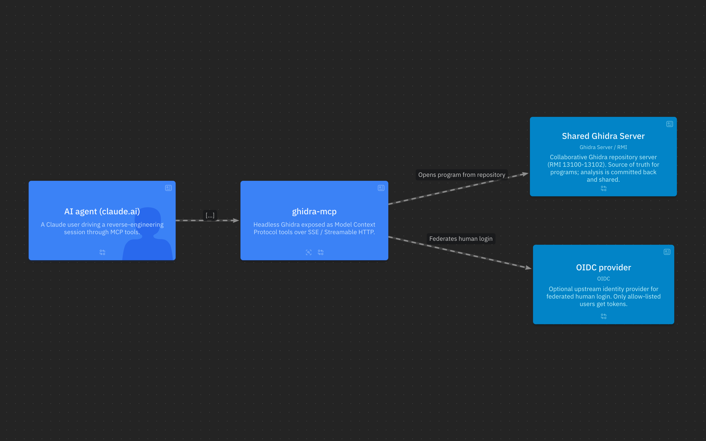
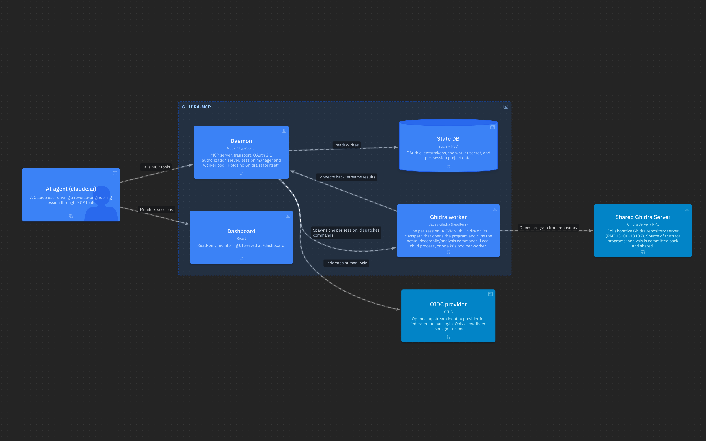

# ghidra-mcp

[](https://discord.gg/MHK2Dg9)

**Headless [Ghidra](https://ghidra-sre.org/) as an MCP server.** A single TypeScript
daemon exposes Ghidra's reverse-engineering capabilities — decompilation, disassembly,
cross-references, type/structure editing, call graphs, data-flow tracing, scripting and
more — as [Model Context Protocol](https://modelcontextprotocol.io) tools over **SSE**
and **Streamable HTTP**. Each session is driven by a real Java Ghidra process, so the
results are exactly what Ghidra produces, not an approximation.

It runs two ways from the same codebase:

- **Locally** for a single user — bound to loopback, no auth, one command to start.
- **Cloud-native** as an OAuth-secured **claude.ai connector**: a daemon pod that
  spawns one Ghidra worker pod per session and talks to a **shared Ghidra Server**.

If this saves you time, you can [sponsor the work](https://github.com/sponsors/jaenster).

## Concept

Ghidra is a heavyweight desktop reverse-engineering suite. ghidra-mcp runs it
*headless* and puts a thin, fast protocol in front of it so an LLM agent can drive an
analysis the way a human would in the GUI — open a program, decompile a function,
rename a variable, lay down a struct, follow an xref — but programmatically and at scale.

Two processes, one protocol boundary:

- **Daemon** (Node/TypeScript) — the MCP server, transport, OAuth authorization server,
  session manager and worker pool. Holds no Ghidra state itself.
- **Worker** (Java) — a `com.ghidramcp.Worker` JVM with Ghidra on its classpath. One
  per session. Opens the program and executes the actual analysis commands.

The daemon launches a worker through a pluggable **backend**: a local child process
(default) or **one Kubernetes pod per worker** (`GHIDRA_MCP_WORKER_BACKEND=k8s`).

## Architecture



> Diagrams are generated from the [LikeC4](https://likec4.dev) model in
> [`docs/architecture/ghidra-mcp.c4`](docs/architecture/ghidra-mcp.c4)
> (`npx likec4 serve docs/architecture` to explore interactively).

### Local mode

```
MCP client --stdio/HTTP--> daemon (Node) --spawns--> java worker (child process)
                                                          |
                                                          v
                                                  local .gpr project / binary
```

`ghidra --stdio` runs a stdio bridge for desktop MCP clients; or run the daemon on a
port and point an MCP client at `/mcp` or `/sse`.

### Cloud-native mode

The daemon pod is just the Node process — it does **not** run Ghidra in-process. When a
client opens a program, the daemon **creates a worker pod** via the Kubernetes API. That
pod runs the same image (JVM entrypoint), connects **back** to the daemon over the
in-cluster Service, opens the program from the **shared Ghidra Server**, and serves the
analysis. The pod is deleted when the session ends, and garbage-collected (via
`ownerReferences`) if the daemon itself dies.



In Kubernetes each container above maps to a pod: the **Daemon** is the long-lived
Deployment, and every **Ghidra worker** is a short-lived pod the daemon creates through
the Kubernetes API (one per session) and reaps when the session ends.

```
   claude.ai --HTTPS--> Ingress --> ghidra-mcp Service --> daemon pod (Node, OAuth)
                                                              |  create/delete/watch
                                                              v  (k8s API, namespaced RBAC)
                                       worker pod    worker pod    worker pod ...
                                       (java JVM)     (java JVM)    (java JVM)
                                           |  each connects back to the daemon Service,
                                           v  then opens its program from:
                                     shared Ghidra Server (RMI :13100-13102)
```

Why a pod per worker: each Ghidra JVM is memory-hungry and holds process-wide locks.
Isolating workers in their own pods (each with its own memory limit and scratch volume)
removes the heap/lock contention of cramming every JVM into one process, and lets
concurrency scale with cluster capacity instead of a single pod's RAM.

### The shared Ghidra Server (required for cloud-native)

Cloud-native mode is built around a **collaborative [Ghidra Server](https://ghidra-sre.org/InstallationGuide.html#GhidraServer)**
(the RMI repository server, ports 13100-13102) as the source of truth for programs:

- Clients open a program by **repository path**; the daemon supplies the server identity
  from `GHIDRA_SERVER_HOST:PORT`. Credentials always come from the environment, never the
  URL.
- Multiple workers (and human Ghidra GUI users) share the same repository, so analysis —
  renames, structs, comments, bookmarks — is committed back and persists across sessions.
- The worker image's bundled Ghidra version **must match** the Ghidra Server version —
  the RMI handshake is version-checked.

Without a shared server you can still run local mode against a local binary/project, but
the multi-pod, multi-user connector model assumes the server.

### Naming a program

With `GHIDRA_SERVER_REPO` set, a program is named by its path in that repository — no
host, no scheme, nothing to memorise:

```
create_session program="/windows/1.09d/D2Game.dll"     # relative to the configured repo
create_session program="OtherRepo/windows/Game.exe"    # a different repo on the same server
create_session program="1.09d/D2Game.dll"              # a suffix that matches exactly one program
create_session binaryPath="ghidra://host[:port]/Repo/path"   # a different server; port defaults to 13100
```

`list_repos` and `list_programs` need **no session**: the daemon keeps one worker connected
to the server with nothing open, so the repository can be browsed before a program is
chosen. It is reaped once idle (`GHIDRA_MCP_REPO_SESSION_IDLE_MS`).

A path the worker cannot reach fails with the reason — that the worker is elsewhere, and
which server it *is* connected to — rather than "Binary not found".

### Getting binaries in

`import_program` puts a binary into the repository. The **worker** fetches the bytes, so
give it a URL it can reach (or `localPath` on the worker host, or inline `bytesBase64`):

```
import_program url="https://files.example.com/1.09d/D2Game.dll" \
               programPath="/windows/1.09d/D2Game.dll"
```

Analysis is far too slow to hold a request open, so the import runs as a background job and
returns a `jobId` that `import_status` polls (pass `wait=true` for small ones). `items`
imports many in a single job. `delete_program` and `move_program` fix an import that landed
in the wrong place.

With a shared repository configured, opening a **loose local binary is refused**: it would
be imported into a project that dies with the session, so the analysis could never be
committed, shared or reopened. Import it first. (Pure local mode, with no server configured,
still opens a local binary or `.gpr` directly — there is nothing shared to import into.)

## Packages

| Package | Role |
|-|-|
| `@ghidra-mcp/shared` | Types, worker<->daemon protocol, platform/path detection, backend selection |
| `@ghidra-mcp/mcp` | MCP server + tool definitions + tool->daemon dispatcher |
| `@ghidra-mcp/daemon` | HTTP/SSE/Streamable server, OAuth AS, session manager, worker pool, k8s launcher, state DB |
| `@ghidra-mcp/cli` | `ghidra` binary: starts the daemon, or a stdio bridge for MCP clients |
| `@ghidra-mcp/dashboard` | React monitoring UI (served at `/dashboard`) |

The `ghidra-worker/` directory is a Gradle-built Java fat-JAR (`com.ghidramcp.Worker`)
compiled against a local Ghidra install.

## Build

```bash
npm install
npm run install:ghidra     # downloads Ghidra (scripts/install-ghidra.sh)
npm run install:worker     # gradle build -> ghidra-worker.jar
npm run build              # builds all TS packages
```

Or build the all-in-one container (Node + JRE + Ghidra + worker jar) with the `Dockerfile`.

## Run locally

```bash
node packages/cli/dist/bin.js --port 8432    # start daemon
node packages/cli/dist/bin.js --stdio        # stdio bridge for an MCP client
```

Locally the daemon binds `127.0.0.1` and requires **no auth**.

## Run as a remote claude.ai connector

Set both `GHIDRA_MCP_PUBLIC_URL` **and** `GHIDRA_MCP_AUTH_SECRET` and the daemon becomes
a self-contained OAuth 2.1 authorization server (Dynamic Client Registration + PKCE)
gating the MCP endpoints. Optionally federate the human login to an upstream OIDC
provider with the `GHIDRA_MCP_OIDC_*` vars (only allow-listed users get tokens).

| Env var | Purpose | Default |
|-|-|-|
| `GHIDRA_MCP_HOST` | Bind address — set `0.0.0.0` in a container | `127.0.0.1` |
| `GHIDRA_MCP_PORT` | Listen port | `8432` |
| `GHIDRA_MCP_PUBLIC_URL` | Public HTTPS URL (OAuth issuer / resource id) | — |
| `GHIDRA_MCP_AUTH_SECRET` | Connector password shown on the consent screen | — |
| `GHIDRA_MCP_OAUTH_SCOPES` | Supported scopes (space/comma separated) | `ghidra` |
| `GHIDRA_MCP_ACCESS_TTL` | Access-token lifetime (sec) | `3600` |
| `GHIDRA_MCP_REFRESH_TTL` | Refresh-token lifetime (sec) | `2592000` |
| `GHIDRA_MCP_OIDC_ISSUER` | Upstream OIDC issuer (enables federated login) | — |
| `GHIDRA_MCP_OIDC_CLIENT_ID` / `_CLIENT_SECRET` | OIDC client credentials | — |
| `GHIDRA_MCP_OIDC_ALLOWED_USERS` | Allow-list of OIDC usernames | — |
| `GHIDRA_MCP_WORKER_SECRET` | Shared secret for the `/internal/*` worker control-plane | auto-generated, persisted in the data dir |

**Shared Ghidra Server + worker backend:**

| Env var | Purpose | Default |
|-|-|-|
| `GHIDRA_SERVER_HOST` / `GHIDRA_SERVER_PORT` | Default Ghidra Server the daemon connects to | — / `13100` |
| `GHIDRA_SERVER_REPO` | Default repository, so clients name a program by its path alone | — |
| `GHIDRA_SERVER_USER` / `GHIDRA_SERVER_PASSWORD` | Worker's Ghidra Server credentials | — |
| `GHIDRA_MCP_REPO_SESSION_IDLE_MS` | Idle time before the repo-browsing worker is reaped | `600000` |
| `GHIDRA_MCP_WORKER_BACKEND` | `process` (local child) or `k8s` (one pod per worker) | `process` |
| `GHIDRA_MCP_WORKER_DAEMON_URL` | In-cluster Service URL workers call back to (k8s) | — |
| `GHIDRA_MCP_WORKER_IMAGE` | Worker pod image (k8s) | inherits daemon's own image |
| `GHIDRA_MCP_NAMESPACE` | Namespace to create worker pods in (k8s) | `ghidra-mcp` |
| `GHIDRA_MCP_MEMORY` | Worker JVM heap (pod limit ~ heap + 512Mi) | — |
| `GHIDRA_MCP_MAX_WORKERS` | Max concurrent worker pods/processes | — |
| `GHIDRA_HOME` | Ghidra install directory | platform default |

OAuth activates only when both `GHIDRA_MCP_PUBLIC_URL` **and** `GHIDRA_MCP_AUTH_SECRET`
are set. Add `<GHIDRA_MCP_PUBLIC_URL>/mcp` as a custom connector in claude.ai; it
discovers the OAuth endpoints, registers via DCR, and prompts for the connector password.

### Endpoints

- MCP: `POST/GET/DELETE /mcp` (Streamable HTTP), `GET /sse` + `POST /sse/messages` (SSE) — **token-gated when OAuth is on**
- OAuth: `/.well-known/oauth-authorization-server`, `/.well-known/oauth-protected-resource`, `/authorize`, `/token`, `/register`, `/revoke`, `/oauth/consent`
- Open: `/health`, `/status`, `/dashboard`
- Internal (worker control-plane): `/internal/worker/:id/*` + the log WebSocket — authenticated with the per-daemon `GHIDRA_MCP_WORKER_SECRET`. Keep it off the ingress; only loopback / in-pod traffic should reach it.

## Kubernetes

A self-host **kustomize template** lives in [`deploy/k8s/`](deploy/k8s/) — base
(deployment, service, namespaced RBAC for pod create/delete/watch, PVC) plus an example
overlay (ingress, image tag, `config.env`). See [`deploy/k8s/README.md`](deploy/k8s/README.md)
for the secret setup and the daemon->worker-pod model. Deployment is intentionally
decoupled from this repo: CI publishes the image to `ghcr.io`; roll it out from your own
GitOps tooling (e.g. ArgoCD Image Updater, or a `newTag` bump in your infra repo).

```bash
kubectl apply -k deploy/k8s/overlays/example
```

## Tests

```bash
npm run test:unit
npm run test:e2e
```

## License

MIT — see [LICENSE](LICENSE).
